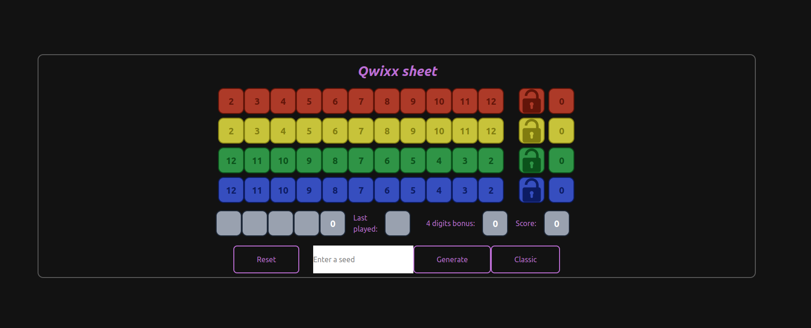
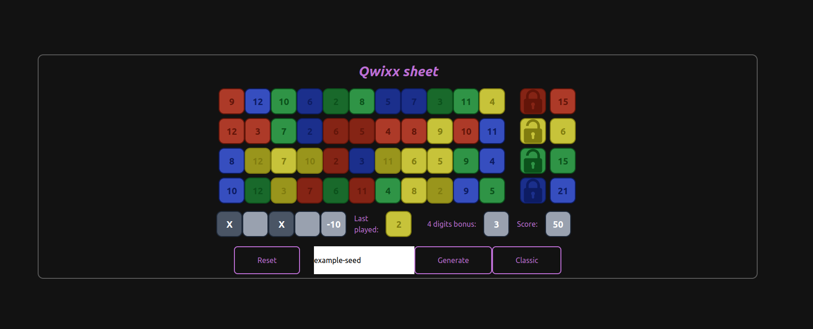
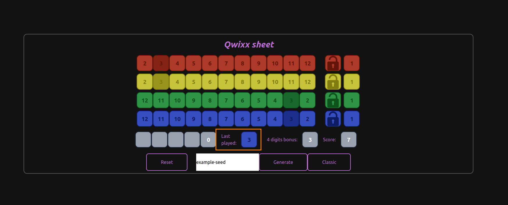

# qwixx-sheet

This repository contains the code to power a webserver offering a scoring sheet to play [Qwixx](https://commons.wikimedia.org/wiki/Category:Qwixx) (wikimedia link).
As opposed to the classic game, this version comes with a couple of additions to the original scoring system.

You can find screenshots below.





# Badges

[](https://github.com/Knoblauchpilze/qwixx-sheet/actions/workflows/build-and-push.yml)

[](https://codecov.io/gh/Knoblauchpilze/qwixx-sheet)

# Installation

This project is a simple webapp using [svelte](https://svelte.dev/) as a frontend framework. The instructions below will help you clone the project and set it up so that you can start working on it.

For your convenience a `Makefile` is provided with targets for the most common operations.

## Clone the repository

```bash
git clone git@github.com:Knoblauchpilze/qwixx-sheet.git
```

You can then move to the directory that was created by the clone operation with e.g.:
```bash
cd qwixx-sheet
```

## Install dependencies

You can use the provided [Makefile](Makefile) to install the dependencies with:

```bash
make install
```

This will instruct `npm` to download all the required libraries and setup the project.

## Run the development server

Once this is done you can run the server locally with:

```bash
make dev
```

## Publish and deploy

This project defines a working CI (see [workflow](.github/workflows/build-and-push.yml)) based on GitHub actions. The process is as follows:
* verify code style
* run the tests
* build a [Docker](build/Dockerfile) image of the project
* deploy the project in a remote cluster

As for many other personal projects this one is deployed over at [ec2-deployment](https://github.com/Knoblauchpilze/ec2-deployment).

You can replace the variables controlling where the deployment happens in the CI to match your own needs.

Also you can build the docker image of the service locally with the `Makefile`:

```bash
make docker
```

You can then run the server in the docker image locally with:

```bash
docker run -p 3001:3001 totocorpsoftwareinc/qwixx-sheet-frontend:HASH
```

# How does the scoring work?

## Overview

The scoring sheet provides two main modes of calculating the score: classic and custom.

Classic is the original scoring system for the game: there are four lines of different colors sorted in ascending or descending order.

Custom generates at random four lines with the following characteristics:
* each line contains all digits from 2 to 12.
* each digit (combination of value and color) exists only once in the sheet

## Penalties

As in the regular game, this sheet defines 4 penalties worth -5 points each.

## Bonus

In addition to the regular scoring system, this sheet automatically adds a bonus of 3 points for each group of four digits with the same value that were ticked. This is shown in the screenshot below:


In this example as all threes are ticked, a bonus of 3 points is added to the score of 4. The value of the bonus is visible directly left of the global score.

## History

At the right of the penalties area a history section is displayed (the orange box in the screenshot below):



It allows to undo the last moves one after the other and return back to a previous state of the game. To do so, just click on the digit next to `Last played:`. This will untick the displayed digit and update the score accordingly. The result of clicking the blue 3 in the above screenshot leads to this view:


You can continue clicking until all digits have been rewinded. Note that in case you manually remove a digit that is not the last one (say in the above example the red 3), the history will skip this value when it reaches it.

Additionally this history also allows to indicate what was the last move played by the user.

## Generating a new game

The bottom part of the scoring sheet defines ways to reset and start a new game.

### Reset button

The reset button restarts the current game by unticking all digits and penalties and setting the score to 0.

## Generate and the seed input

This allows to start a new game with a custom layout. As opposed to the classic look, the lines in this mode will be chaotic and generally not contain only a single color or be ordered.

Clicking on the `Generate` button without providing a seed will pick one automatically and generate the game with it: you will be able to see the seed after the generation.

If you want you can also provide a seed: the random generation will use this as a starting point, allowing to get deterministic results. This is also useful in case you're playing with other players and want to share the same custom layout.

### Classic

This starts a new classic game of Qwixx. All digits and penalties are reset and the layout matches the classic look of Qwixx.

# Future work

This project could be improved in several ways.

## SVG icons

We use SVG icons to represent the lock of a line. These icons are identical for all lines, they are just shown with a tint to match the line.

Given the technologies we use (notably [tailwindcss](https://tailwindcss.com/)) it is theoretically possible to style a SVG directly with CSS (see e.g. [fill](https://tailwindcss.com/docs/fill#examples), or [stroke](https://tailwindcss.com/docs/stroke#using-the-current-color)).

Additionally, it is also possible to use a SVG directly as a component in Svelte (see [this playground](https://svelte.dev/playground/86553af5c35449ab88e34f1e50eb298f?version=5.19.7) link or this [StackOverflow post](https://stackoverflow.com/questions/66069647/best-way-to-import-svg-icons-into-a-svelte-app)).

When experimenting it was hard to get:
* the icon to size with the component it is embedded in but not grow bigger
* the styling to work

So much so that this app currently uses different SVGs for each line (see the [assets](src/lib/assets)).

This is not ideal because although we have a flexible palette regarding the color of each line (see [app.css](src/styles/app.css)) we have a hard coded color for each SVG.

There must be a better way which we could explore (see maybe [this link](https://stackoverflow.com/questions/76960753/changing-the-fill-color-of-svg-with-tailwind-css-not-working)?).

## End game screen

In the original game the round is over when two lines are completed or when all penalties have been ticked by a player.

This version does not have such an exit condition and you can continue playing even after this.

Ideally we would like to display something or indicate to the user that the game is over.

## Language selection

The application is written in English, but we could add a button to pick a language that would be matching the users' preferences.

Maybe it's even possible to detect that automatically and adapt the page on load.

## Export as a mobile app

Initially this project got inspired by [this mobile app](https://play.google.com/store/apps/details?id=nl.stersoftware.qwixx&hl=en). In order to increase the usability of this project it would be interesting to try to port this as a mobile app as well.

It seems this is possible when using `sveltekit`. See for example:
* [this article](https://khromov.se/how-i-published-a-gratitude-journaling-app-for-ios-and-android-using-sveltekit-and-capacitor/) found from a reddit post.
* the [capacitor](https://capacitorjs.com/solution/svelte) page about using svelte.

There might be limitations: from a quick look it is not possible to use `+page.server.ts` pages. This would mean that the cookies mechanism we use to store the seed and the layout would have to be reworked.
